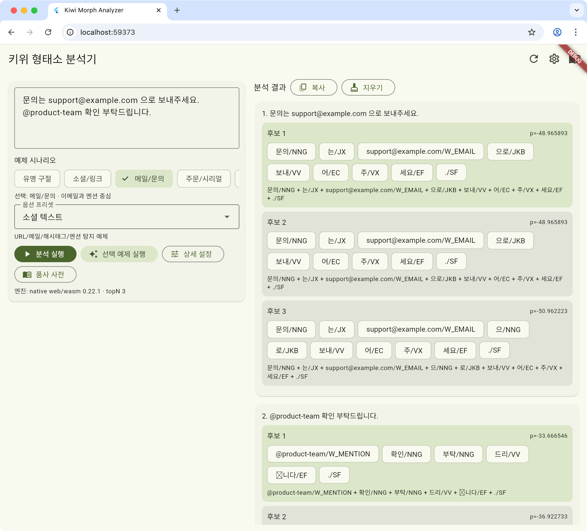

# flutter_kiwi_nlp

Korean morphological analysis plugin for Flutter powered by Kiwi.

## Table of Contents

- [Documentation](#documentation)
- [AI Guide (for assistant users)](#ai-guide-for-assistant-users)
- [Platform Status (Summary)](#platform-status-summary)
- [Package Name](#package-name)
- [English Full Guide](#flutter_kiwi_nlp-english)
- [English Table of Contents](#english-table-of-contents)

## Documentation

- Korean: [`README.ko.md`](https://github.com/JAICHANGPARK/flutter_kiwi_nlp/blob/main/README.ko.md)
- English: [`README.en.md`](https://github.com/JAICHANGPARK/flutter_kiwi_nlp/blob/main/README.en.md)
- LLM index: [`llms.txt`](https://github.com/JAICHANGPARK/flutter_kiwi_nlp/blob/main/llms.txt)
- Technical Report (English PDF): [`doc/technical_report_arxiv.pdf`](doc/technical_report_arxiv.pdf)
- Repository skill:
  [`skills/flutter-kiwi-nlp/SKILL.md`](https://github.com/JAICHANGPARK/flutter_kiwi_nlp/blob/main/skills/flutter-kiwi-nlp/SKILL.md)

## AI Guide (for assistant users)

- Start from [`llms.txt`](https://github.com/JAICHANGPARK/flutter_kiwi_nlp/blob/main/llms.txt) so the assistant can discover key files
  quickly.
- Use the repository skill
  [`skills/flutter-kiwi-nlp/SKILL.md`](https://github.com/JAICHANGPARK/flutter_kiwi_nlp/blob/main/skills/flutter-kiwi-nlp/SKILL.md) for
  a parity-first workflow.
- Run
  [`./skills/flutter-kiwi-nlp/scripts/verify_plugin.sh`](https://github.com/JAICHANGPARK/flutter_kiwi_nlp/blob/main/skills/flutter-kiwi-nlp/scripts/verify_plugin.sh)
  after changes.

## Platform Status (Summary)

| Platform | Status |
| --- | --- |
| Android | Supported |
| iOS | Supported (auto-build on first iOS build) |
| macOS | Supported (auto-build on first macOS build) |
| Linux | Supported (auto-build on first Linux build) |
| Windows | Supported (auto-build on first Windows build) |
| Web | Supported |
| Fuchsia | Not supported |

## Package Name

`pubspec.yaml` package name is `flutter_kiwi_nlp`.


---

# flutter_kiwi_nlp (English)

Native-first Flutter plugin for Korean morphological analysis powered by Kiwi.

## English Table of Contents

- [Package Name](#package-name-1)
- [AI Integration Guide](#ai-integration-guide)
- [Supported Platforms](#supported-platforms)
- [Unsupported Platforms](#unsupported-platforms)
- [Features](#features)
- [Screenshots](#screenshots)
- [Available APIs (Quick Table)](#available-apis-quick-table)
- [Size Impact (Approx.) and `kiwipiepy` Comparison](#size-impact-approx-and-kiwipiepy-comparison)
- [Performance Benchmark (`kiwipiepy` Comparison)](#performance-benchmark-kiwipiepy-comparison)
- [Install](#install)
- [Integrate Into a Flutter App](#integrate-into-a-flutter-app)
- [Common Usage Patterns](#common-usage-patterns)
- [Model Path Configuration Guide](#model-path-configuration-guide)
- [Model Path Resolution](#model-path-resolution)
- [Android Auto Build](#android-auto-build)
- [iOS Auto Prepare](#ios-auto-prepare)
- [macOS Auto Prepare](#macos-auto-prepare)
- [Linux Auto Prepare](#linux-auto-prepare)
- [Windows Auto Prepare](#windows-auto-prepare)
- [Common Issues](#common-issues)
- [License](#license)

## Package Name

Package name in `pubspec.yaml` is `flutter_kiwi_nlp`.
Use `flutter_kiwi_nlp` for dependency and import statements.

## AI Integration Guide

If you use an AI coding assistant for this plugin, start here:

- LLM index: [`llms.txt`](https://github.com/JAICHANGPARK/flutter_kiwi_nlp/blob/main/llms.txt)
- Repository skill: [`skills/flutter-kiwi-nlp/SKILL.md`](https://github.com/JAICHANGPARK/flutter_kiwi_nlp/blob/main/skills/flutter-kiwi-nlp/SKILL.md)
- Skill API reference:
  [`skills/flutter-kiwi-nlp/references/api-surface.md`](https://github.com/JAICHANGPARK/flutter_kiwi_nlp/blob/main/skills/flutter-kiwi-nlp/references/api-surface.md)
- Skill runtime/build reference:
  [`skills/flutter-kiwi-nlp/references/runtime-and-build.md`](https://github.com/JAICHANGPARK/flutter_kiwi_nlp/blob/main/skills/flutter-kiwi-nlp/references/runtime-and-build.md)
- Skill verify script:
  [`skills/flutter-kiwi-nlp/scripts/verify_plugin.sh`](https://github.com/JAICHANGPARK/flutter_kiwi_nlp/blob/main/skills/flutter-kiwi-nlp/scripts/verify_plugin.sh)

For Codex, invoke the skill explicitly in your prompt:

```text
Use $flutter-kiwi-nlp to implement and validate this change.
```

Then run:

```bash
./skills/flutter-kiwi-nlp/scripts/verify_plugin.sh
```

## Supported Platforms

| Platform | Status | Notes |
| --- | --- | --- |
| Android | Supported | Builds `libkiwi.so` automatically during Android `preBuild` if missing. |
| iOS | Supported | Generates `Kiwi.xcframework` automatically during `pod install` when missing. |
| macOS | Supported | Builds `libkiwi.dylib` automatically during `pod install` when missing. |
| Linux | Supported | Builds `libkiwi.so` automatically during Linux build when missing. |
| Windows | Supported | Builds `kiwi.dll` automatically during Windows build when missing. |
| Web | Supported | Uses `kiwi-nlp` WASM backend. |

## Unsupported Platforms

| Platform | Status | Notes |
| --- | --- | --- |
| Fuchsia | Not supported | No Fuchsia backend implementation. |

## Features

- Unified `KiwiAnalyzer` API on native (FFI) and web (WASM).
- Typed result models: `KiwiAnalyzeResult`, `KiwiCandidate`, `KiwiToken`.
- Runtime user dictionary update via `addUserWord`.
- Built-in default model assets (`assets/kiwi-models/cong/base`).
- Native fallback default model download/cache.
- Web fallback from same-origin asset URL loading to archive download.

## Screenshots

| Web | macOS |
| --- | --- |
|  |  |

| Android (Screen 1) | Android (Screen 2) |
| --- | --- |
|  |  |

## Available APIs (Quick Table)

### Core API

| API | Signature | Description |
| --- | --- | --- |
| `KiwiAnalyzer.create` | `Future<KiwiAnalyzer> create({String? modelPath, String? assetModelPath, int numThreads = -1, int buildOptions = KiwiBuildOption.defaultOption, int matchOptions = KiwiMatchOption.allWithNormalizing})` | Creates an analyzer instance. You can control model path, build options, and match options. |
| `KiwiAnalyzer.nativeVersion` | `String get nativeVersion` | Returns a backend version string (for example native version or web/wasm version). |
| `KiwiAnalyzer.analyze` | `Future<KiwiAnalyzeResult> analyze(String text, {KiwiAnalyzeOptions options = const KiwiAnalyzeOptions()})` | Runs morphological analysis and returns candidate results. |
| `KiwiAnalyzer.analyzeTokenCount` | `Future<int> analyzeTokenCount(String text, {KiwiAnalyzeOptions options = const KiwiAnalyzeOptions()})` | Runs analysis and returns only the first-candidate token count (useful for tokenizer-focused benchmarks). |
| `KiwiAnalyzer.addUserWord` | `Future<void> addUserWord(String word, {String tag = 'NNP', double score = 0.0})` | Adds a runtime user dictionary entry. |
| `KiwiAnalyzer.close` | `Future<void> close()` | Closes the analyzer and releases resources. |

On unsupported platforms, creating or calling `KiwiAnalyzer` throws
`KiwiException`.

### Options/Constants API

| API | Type | Description |
| --- | --- | --- |
| `KiwiAnalyzeOptions(topN, matchOptions)` | class | Option object for `analyze`. Defaults: `topN = 1`, `matchOptions = KiwiMatchOption.allWithNormalizing`. |
| `KiwiBuildOption.integrateAllomorph` | `int` bit flag | Integrate allomorph option. |
| `KiwiBuildOption.loadDefaultDict` | `int` bit flag | Load default dictionary option. |
| `KiwiBuildOption.loadTypoDict` | `int` bit flag | Load typo dictionary option. |
| `KiwiBuildOption.loadMultiDict` | `int` bit flag | Load multi-word dictionary option. |
| `KiwiBuildOption.modelTypeDefault` | `int` | Model type constant. |
| `KiwiBuildOption.modelTypeLargest` | `int` | Model type constant. |
| `KiwiBuildOption.modelTypeKnlm` | `int` | Model type constant. |
| `KiwiBuildOption.modelTypeSbg` | `int` | Model type constant. |
| `KiwiBuildOption.modelTypeCong` | `int` | Model type constant. |
| `KiwiBuildOption.modelTypeCongGlobal` | `int` | Model type constant. |
| `KiwiBuildOption.defaultOption` | `int` | Recommended default build option combination. |
| `KiwiMatchOption.url`/`email`/`hashtag`/`mention`/`serial` | `int` bit flag | URL/email/hashtag/mention/serial detection options. |
| `KiwiMatchOption.normalizeCoda` | `int` bit flag | Coda normalization option. |
| `KiwiMatchOption.joinNounPrefix`/`joinNounSuffix` | `int` bit flag | Noun prefix/suffix joining options. |
| `KiwiMatchOption.joinVerbSuffix`/`joinAdjSuffix`/`joinAdvSuffix` | `int` bit flag | Verb/adjective/adverb suffix joining options. |
| `KiwiMatchOption.splitComplex` | `int` bit flag | Complex form split option. |
| `KiwiMatchOption.zCoda` | `int` bit flag | Coda-related matching option. |
| `KiwiMatchOption.compatibleJamo` | `int` bit flag | Compatibility jamo option. |
| `KiwiMatchOption.splitSaisiot`/`mergeSaisiot` | `int` bit flag | Saisiot split/merge options. |
| `KiwiMatchOption.all` | `int` | Baseline match option bundle. |
| `KiwiMatchOption.allWithNormalizing` | `int` | `all + normalizeCoda` bundle. |

### Result/Exception Model API

| API | Type | Description |
| --- | --- | --- |
| `KiwiAnalyzeResult.candidates` | `List<KiwiCandidate>` | Candidate list for analysis output. |
| `KiwiCandidate.probability` | `double` | Candidate score/probability. |
| `KiwiCandidate.tokens` | `List<KiwiToken>` | Token list for the candidate. |
| `KiwiToken.form` | `String` | Token surface form. |
| `KiwiToken.tag` | `String` | Part-of-speech tag. |
| `KiwiToken.start`/`length` | `int` | Start offset and length in input text. |
| `KiwiToken.wordPosition`/`sentPosition` | `int` | Word/sentence index positions. |
| `KiwiToken.score`/`typoCost` | `double` | Token score and typo cost. |
| `KiwiException` | `Exception` | Plugin error type. Check the `message` field for details. |

## Size Impact (Approx.) and `kiwipiepy` Comparison

As of `2026-02-18` (workspace snapshot):

### A. Source artifact footprint (before app packaging)

| Item | Basis | Size | Notes |
| --- | --- | --- | --- |
| `flutter_kiwi_nlp` default model | Uncompressed model directory (`assets/kiwi-models/cong/base`) | `99,308,057 bytes` (`94.71 MiB`) | Actual bundled model payload basis |
| `flutter_kiwi_nlp` default model (tgz) | Same directory compressed locally (`.tgz`) | `79,494,329 bytes` (`75.81 MiB`) | Local compressed-size reference |
| `kiwipiepy_model 0.22.1` | PyPI source distribution (`.tar.gz`) | `79.5 MB` (published) | Published compressed package size on PyPI |
| Android `libkiwi.so` (source artifact, arm64-v8a) | `android/src/main/jniLibs/arm64-v8a/libkiwi.so` | `166,229,088 bytes` (`158.53 MiB`) | `with debug_info`, `not stripped` |
| Android `libkiwi.so` (source artifact, x86_64) | `android/src/main/jniLibs/x86_64/libkiwi.so` | `200,071,656 bytes` (`190.80 MiB`) | `with debug_info`, `not stripped` |

### B. Example app package output (debug vs release)

| Item | Basis | Size | Notes |
| --- | --- | --- | --- |
| `app-debug.apk` | `example/build/app/outputs/flutter-apk/app-debug.apk` | `178,454,872 bytes` (`170.19 MiB`) | Example app build output |
| `app-release.apk` | `example/build/app/outputs/flutter-apk/app-release.apk` | `113,030,559 bytes` (`107.80 MiB`) | Example app build output |
| `libkiwi.so` inside APK (arm64-v8a) | APK `lib/arm64-v8a/libkiwi.so` entry | `7,613,192 bytes` | Stripped during Android packaging |
| `libkiwi.so` inside APK (x86_64) | APK `lib/x86_64/libkiwi.so` entry | `11,381,344 bytes` | Stripped during Android packaging |
| Model files inside release APK | Sum of `assets/.../kiwi-models/cong/base/*` entries | `79,574,759 bytes` compressed (`99,308,057` uncompressed) | ZIP-level compression applied |

Why do the numbers look different?

- Different measurement bases produce different numbers.
- Source artifact size and packaged output size are different stages.
- Android packaging strips debug symbols from native libraries by default.
- Model files are ZIP-compressed inside APK, while source directories are not.
- Current APK contains both ABIs (`arm64-v8a`, `x86_64`); ABI-split delivery
  can reduce per-device download size.
- Final store delivery size can further differ by app bundle split/compression.

References:

- https://pypi.org/project/kiwipiepy-model/
- https://pypi.org/project/kiwipiepy/

## Performance Benchmark (`kiwipiepy` Comparison)

To compare `flutter_kiwi_nlp` against `kiwipiepy` fairly, run both with the
same corpus, `top_n`, and warm-up/measurement counts.

This repository now includes automation scripts for that workflow.

1. Prepare dependencies

```bash
uv venv
source .venv/bin/activate
cd example
flutter pub get
cd ..
uv pip install kiwipiepy
```

2. Run benchmark comparison (example: macOS)

```bash
uv run python tool/benchmark/run_compare.py --device macos

# Paper-style repeated trials with explicit parity options.
uv run python tool/benchmark/run_compare.py \
  --device macos \
  --trials 5 \
  --warmup-runs 3 \
  --measure-runs 15 \
  --num-threads -1 \
  --num-workers -1 \
  --build-options 1039 \
  --create-match-options 8454175 \
  --analyze-match-options 8454175

# Tokenizer-oriented comparison (Flutter token_count vs Python tokenize).
uv run python tool/benchmark/run_compare.py \
  --device macos \
  --flutter-analyze-impl token_count \
  --kiwi-analyze-impl tokenize
```

3. Inspect the report

```bash
cat benchmark/results/comparison.md
```

Generated files:

- `benchmark/results/flutter_kiwi_benchmark_trials.json`
- `benchmark/results/kiwipiepy_benchmark_trials.json`
- `benchmark/results/flutter_kiwi_benchmark_trial_XX.json`
- `benchmark/results/kiwipiepy_benchmark_trial_XX.json`
- `benchmark/results/flutter_kiwi_benchmark.json` (legacy single-run compatibility: final trial)
- `benchmark/results/kiwipiepy_benchmark.json` (legacy single-run compatibility: final trial)
- `benchmark/results/comparison.md`

Useful `run_compare.py` options:

- `--trials`
- `--warmup-runs` / `--measure-runs` / `--top-n`
- `--num-threads` (Flutter side)
- `--num-workers` (Python side)
- `--build-options`
- `--create-match-options`
- `--analyze-match-options` (or `--match-options`)
- `--flutter-analyze-impl` (`json` or `token_count`)
- `--kiwi-analyze-impl` (`analyze` or `tokenize`)
- `--sample-count` (sample sentence count for POS output comparison)
- `--model-path` (force the same model path on both runtimes)

Use `--flutter-analyze-impl token_count` when you want to isolate tokenizer
core throughput on Flutter by excluding JSON materialization/deserialization
overhead from the measured path.
Use `--kiwi-analyze-impl tokenize` when you want tokenizer-oriented comparison
on the Python side.

The generated report now includes:

- Sample sentence POS output comparison (`flutter_kiwi_nlp` vs `kiwipiepy`)
- Flutter JSON serialization/parsing overhead metrics (pure vs full path)

On mobile targets (`ios`/`android`), `kiwipiepy` still runs on the host Python
runtime. Treat mobile rows as cross-runtime reference unless you provide a
same-device Python environment.

Example table format:

| Metric | flutter_kiwi_nlp (mean ± std) | kiwipiepy (mean ± std) | Ratio (Flutter mean / Kiwi mean) |
| --- | ---: | ---: | ---: |
| Init time (ms, lower better) | 120.40 ± 3.20 | 98.10 ± 2.80 | 1.23x (slower) |
| Throughput (analyses/s, higher better) | 650.20 ± 12.30 | 702.90 ± 8.10 | 0.93x (slower) |
| Throughput (chars/s, higher better) | 192004.11 ± 4102.30 | 200441.00 ± 2310.10 | 0.96x (slower) |
| Throughput (tokens/s, higher better) | 94000.00 ± 2011.30 | 101200.00 ± 1188.40 | 0.93x (slower) |
| Avg latency (ms, lower better) | 1.54 ± 0.03 | 1.42 ± 0.02 | 1.08x (slower) |
| Avg token latency (us/token, lower better) | 16.20 ± 0.25 | 14.75 ± 0.19 | 1.10x (slower) |

## Install

### 1) Install from pub.dev (recommended)

```bash
flutter pub add flutter_kiwi_nlp
```

Or edit `pubspec.yaml` directly:

```yaml
dependencies:
  flutter_kiwi_nlp: ^0.1.1
```

```bash
flutter pub get
```

### 2) Install from a local path (plugin development/testing)

```yaml
dependencies:
  flutter_kiwi_nlp:
    path: ../flutter_kiwi_nlp
```

```bash
flutter pub get
```

## Integrate Into a Flutter App

### 1) Import

```dart
import 'package:flutter_kiwi_nlp/flutter_kiwi_nlp.dart';
```

### 2) Initialize and dispose safely in a `StatefulWidget`

```dart
import 'package:flutter/material.dart';
import 'package:flutter_kiwi_nlp/flutter_kiwi_nlp.dart';

class KiwiDemoPage extends StatefulWidget {
  const KiwiDemoPage({super.key});

  @override
  State<KiwiDemoPage> createState() => _KiwiDemoPageState();
}

class _KiwiDemoPageState extends State<KiwiDemoPage> {
  KiwiAnalyzer? _analyzer;
  bool _loading = false;
  String? _error;
  String _resultText = '';

  @override
  void initState() {
    super.initState();
    _initializeAnalyzer();
  }

  Future<void> _initializeAnalyzer() async {
    setState(() {
      _loading = true;
      _error = null;
    });

    try {
      final KiwiAnalyzer analyzer = await KiwiAnalyzer.create();
      if (!mounted) {
        await analyzer.close();
        return;
      }
      setState(() => _analyzer = analyzer);
    } on KiwiException catch (e) {
      if (!mounted) return;
      setState(() => _error = e.message);
    } catch (e) {
      if (!mounted) return;
      setState(() => _error = '$e');
    } finally {
      if (mounted) {
        setState(() => _loading = false);
      }
    }
  }

  Future<void> _analyzeSample() async {
    final KiwiAnalyzer? analyzer = _analyzer;
    if (analyzer == null) return;

    setState(() {
      _loading = true;
      _error = null;
    });

    try {
      final KiwiAnalyzeResult result = await analyzer.analyze(
        'Why are you picking a fight?',
        options: const KiwiAnalyzeOptions(
          topN: 1,
          matchOptions: KiwiMatchOption.allWithNormalizing,
        ),
      );

      final String line = result.candidates.first.tokens
          .map((KiwiToken token) => '${token.form}/${token.tag}')
          .join(' ');

      if (!mounted) return;
      setState(() => _resultText = line);
    } on KiwiException catch (e) {
      if (!mounted) return;
      setState(() => _error = e.message);
    } finally {
      if (mounted) {
        setState(() => _loading = false);
      }
    }
  }

  @override
  void dispose() {
    _analyzer?.close();
    super.dispose();
  }

  @override
  Widget build(BuildContext context) {
    return Column(
      crossAxisAlignment: CrossAxisAlignment.start,
      children: <Widget>[
        FilledButton(
          onPressed: _loading ? null : _analyzeSample,
          child: const Text('Analyze'),
        ),
        if (_error != null) Text('Error: $_error'),
        if (_resultText.isNotEmpty) Text(_resultText),
      ],
    );
  }
}
```

Dart/Flutter notes:

- `KiwiAnalyzer.create()` and `analyze()` return `Future`s, so use `await`
  inside `try-catch`.
- `_analyzer` uses `KiwiAnalyzer?` due to null safety; it can be `null`
  before initialization.
- After an `await`, check `mounted` before calling `setState`.

## Common Usage Patterns

### Add user dictionary entries

```dart
await analyzer.addUserWord(
  'FlutterKiwi',
  tag: 'NNP',
  score: 2.0,
);
```

### Tune analyze options

```dart
const KiwiAnalyzeOptions options = KiwiAnalyzeOptions(
  topN: 3,
  matchOptions: KiwiMatchOption.url |
      KiwiMatchOption.email |
      KiwiMatchOption.hashtag |
      KiwiMatchOption.normalizeCoda,
);
```

`matchOptions` uses bitwise OR (`|`) composition.

### Iterate through results

```dart
final KiwiAnalyzeResult result = await analyzer.analyze('Input a sentence.');
for (final KiwiCandidate candidate in result.candidates) {
  debugPrint('candidate p=${candidate.probability}');
  for (final KiwiToken token in candidate.tokens) {
    debugPrint('${token.form}\t${token.tag}');
  }
}
```

## Model Path Configuration Guide

### A. Use the built-in default model (simplest)

No extra setup required:

```dart
final KiwiAnalyzer analyzer = await KiwiAnalyzer.create();
```

### B. Use model files from your app assets

Declare assets in your app `pubspec.yaml` and pass `assetModelPath`.

```yaml
flutter:
  assets:
    - assets/kiwi-models/cong/base/
```

```dart
final KiwiAnalyzer analyzer = await KiwiAnalyzer.create(
  assetModelPath: 'assets/kiwi-models/cong/base',
);
```

### C. Use an absolute file-system path

```dart
final KiwiAnalyzer analyzer = await KiwiAnalyzer.create(
  modelPath: '<MODEL_DIR>/kiwi-models/cong/base',
);
```

You can also use environment variables on desktop/CI:

```bash
FLUTTER_KIWI_NLP_MODEL_PATH=<MODEL_DIR> flutter run -d macos
```

PowerShell:

```powershell
$env:FLUTTER_KIWI_NLP_MODEL_PATH='<MODEL_DIR>\kiwi\model\cong\base'
flutter run -d windows
```

### D. Set defaults with `--dart-define`

```bash
flutter run \
  --dart-define=FLUTTER_KIWI_NLP_ASSET_MODEL_PATH=assets/kiwi-models/cong/base
```

To fix web model base URL:

```bash
flutter run -d chrome \
  --dart-define=FLUTTER_KIWI_NLP_WEB_MODEL_BASE_URL=/assets/kiwi-models/cong/base
```

## Model Path Resolution

### Native (`dart:io`)

Order used by `KiwiAnalyzer.create()`:

1. `modelPath` argument
2. `assetModelPath` argument
3. `FLUTTER_KIWI_NLP_MODEL_PATH` (env)
4. `FLUTTER_KIWI_NLP_ASSET_MODEL_PATH` (`--dart-define`)
5. Built-in asset candidates
6. Default model archive download/extract

Default archive URL:

- `https://github.com/bab2min/Kiwi/releases/download/v0.22.2/kiwi_model_v0.22.2_base.tgz`

### Web

Primary model source order:

1. `modelPath` / `assetModelPath` argument
2. `FLUTTER_KIWI_NLP_WEB_MODEL_BASE_URL`
3. `assets/packages/flutter_kiwi_nlp/assets/kiwi-models/cong/base`

If URL-based loading fails for asset-style paths, it falls back to archive
download.

## Android Auto Build

The plugin runs `tool/build_android_libkiwi.sh` from `android/build.gradle`
(`preBuild` dependency).

- Script skips existing ABI outputs by default.
- Force rebuild with `--rebuild`.
- Skip automatic build for one run with:
  - `-Pflutter.kiwi.skipAndroidLibBuild=true`

## iOS Auto Prepare

The plugin runs `tool/build_ios_kiwi_xcframework.sh` from
`ios/flutter_kiwi_nlp.podspec` (`prepare_command`).

- If `ios/Frameworks/Kiwi.xcframework` is missing, it is generated during
  `pod install`.
- Required tools: macOS, Xcode (Command Line Tools), `cmake`, `git`.
- Skip automatic build for one run with:
  - `FLUTTER_KIWI_SKIP_IOS_FRAMEWORK_BUILD=true flutter run -d ios`
- Force rebuild with:
  - `FLUTTER_KIWI_IOS_REBUILD=true flutter run -d ios`

## macOS Auto Prepare

The plugin runs `tool/build_macos_kiwi_dylib.sh` from
`macos/flutter_kiwi_nlp.podspec` (`prepare_command`).

- If `macos/Frameworks/libkiwi.dylib` is missing, it is generated during
  `pod install`.
- Default target archs: `arm64,x86_64` (universal binary via `lipo`).
- Required tools: macOS, Xcode (Command Line Tools), `cmake`, `git`.
- Skip automatic build for one run with:
  - `FLUTTER_KIWI_SKIP_MACOS_LIBRARY_BUILD=true flutter run -d macos`
- Force rebuild with:
  - `FLUTTER_KIWI_MACOS_REBUILD=true flutter run -d macos`
- Override target arch list with:
  - `FLUTTER_KIWI_MACOS_ARCHS=arm64 flutter run -d macos`

## Linux Auto Prepare

The plugin runs `tool/build_linux_libkiwi.sh` from
`linux/CMakeLists.txt` (custom build target).

- If `linux/prebuilt/libkiwi.so` is missing, it is generated during Linux
  build.
- Default target arch: host arch (`x86_64`, `arm64`, etc.).
- Required tools: Linux host, `cmake`, `git`, C/C++ build toolchain.
- Skip automatic build for one run with:
  - `FLUTTER_KIWI_SKIP_LINUX_LIBRARY_BUILD=true flutter run -d linux`
- Force rebuild with:
  - `FLUTTER_KIWI_LINUX_REBUILD=true flutter run -d linux`
- Override target arch with:
  - `FLUTTER_KIWI_LINUX_ARCH=x86_64 flutter run -d linux`

## Windows Auto Prepare

The plugin runs `tool/build_windows_kiwi_dll.ps1` from
`windows/CMakeLists.txt` (custom build target).

- If `windows/prebuilt/kiwi.dll` is missing, it is generated during
  Windows build.
- Default target arch: CMake generator platform (`x64`, `Win32`, `arm64`).
- Required tools: Windows host, PowerShell, Visual Studio C++ toolchain,
  `cmake`, `git`.
- Skip automatic build for one run with:
  - `$env:FLUTTER_KIWI_SKIP_WINDOWS_LIBRARY_BUILD='true'; flutter run -d windows`
- Force rebuild with:
  - `$env:FLUTTER_KIWI_WINDOWS_REBUILD='true'; flutter run -d windows`
- Override target arch with:
  - `$env:FLUTTER_KIWI_WINDOWS_ARCH='x64'; flutter run -d windows`

## Common Issues

- `Failed to load Kiwi dynamic library`
  - Verify native library exists for your platform.
  - Optionally set `FLUTTER_KIWI_NLP_LIBRARY_PATH`.
- Android auto-build fails (`cmake`/`git`/NDK not found)
  - Set `ANDROID_NDK_HOME` or `ANDROID_NDK_ROOT`.
  - Ensure `cmake` and `git` are on PATH.
- iOS auto-build fails (`xcodebuild`/`cmake`/`git` not found)
  - Open Xcode once to finish first-time setup and license acceptance.
  - Check `xcode-select --install`.
  - Ensure `cmake` and `git` are on PATH.
- macOS auto-build fails (`xcrun`/`cmake`/`git` not found)
  - Open Xcode once to finish first-time setup and license acceptance.
  - Check `xcode-select --install`.
  - Ensure `cmake` and `git` are on PATH.
- Linux auto-build fails (`cmake`/`git`/compiler not found)
  - Install build-essential (or equivalent) plus `cmake` and `git`.
  - Ensure required commands are on PATH.
- Windows auto-build fails (`powershell`/`cmake`/`git`/MSVC not found)
  - Install Visual Studio C++ build tools (Desktop development with C++).
  - Run from a shell where `cmake`, `git`, and MSVC toolchain are available.
- Model not found
  - Pass `modelPath` or `assetModelPath`.
  - Or set `FLUTTER_KIWI_NLP_MODEL_PATH`.

## License

See `LICENSE`.
